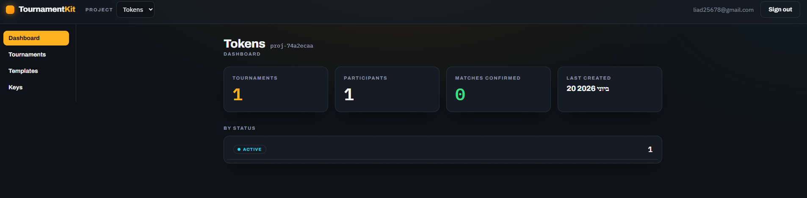
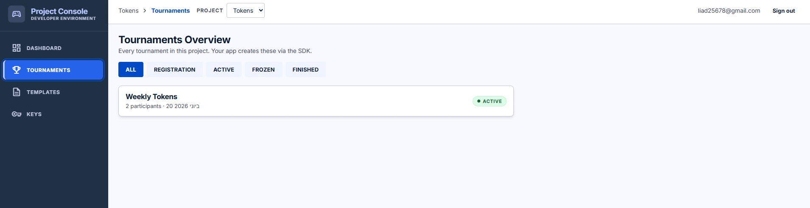
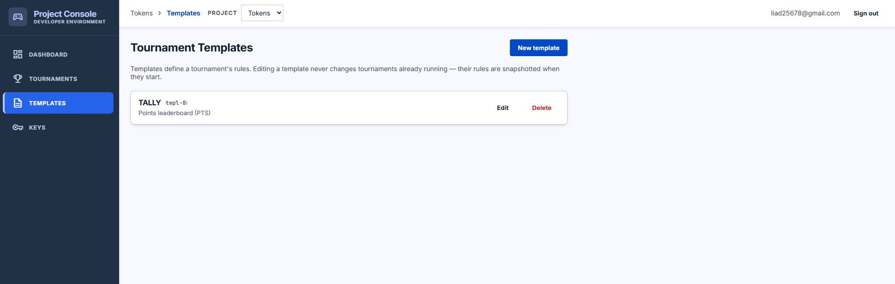
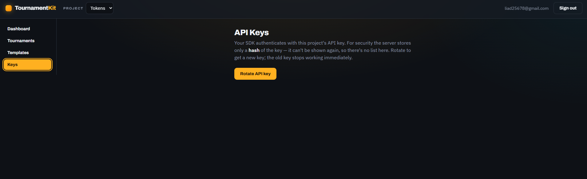
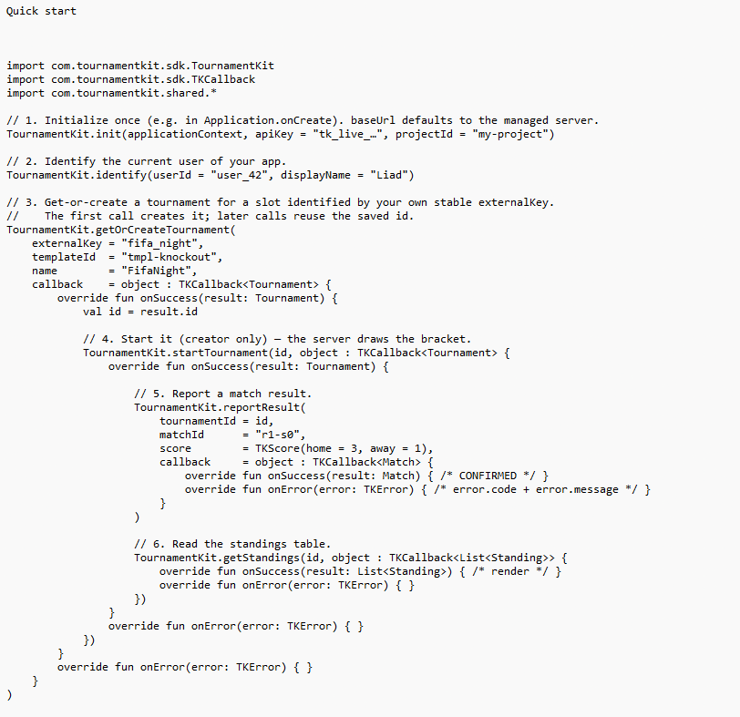
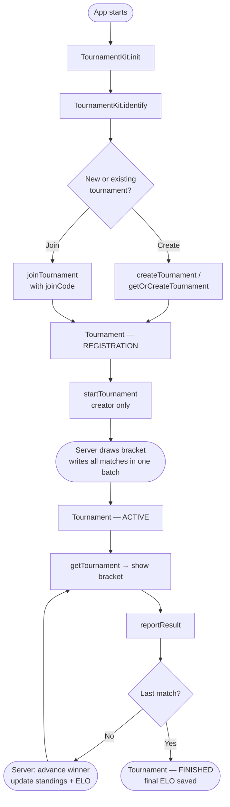

[](https://jitpack.io/#liadnave25/TournamentKit)

# TournamentKit

**Drop a full tournament engine into any Android app in minutes.**

TournamentKit is an Android SDK for running **Knockout**, **League** (round-robin),
**Groups + Knockout**, and **Tally** leaderboard competitions — registration, automatic
draws & byes, result reporting, bracket progression, standings, ELO ratings, and real-time
updates. All logic runs on a managed Ktor + Firestore server; your app just calls the SDK.

---

## Features

- **Four tournament types** — Knockout (single elimination), League (round-robin),
  Groups + Knockout, and open-ended Tally leaderboard
- **Automatic draw with byes** — handles any participant count, not just powers of 2
- **Single-transaction result reporting** — match confirm, bracket advancement, standings
  update, and ELO recalculation happen atomically in one Firestore transaction
- **Real-time updates** — Firestore snapshot listeners push bracket/standings changes to
  every participant without polling
- **Cumulative ELO ratings** — per-project ratings that persist across tournaments
- **Typed error responses** — every failure is a `TKError(code, message)`, never a crash
- **Rate limiting + API key auth** — built into the server; your app just passes a key
- **Ready-made Jetpack Compose UI** — `BracketView`, `LeagueTableView`, `MatchCard`
- **Admin portal** — freeze/unfreeze, result overrides with audit log, analytics dashboard,
  API key rotation

---
## Screenshots

<p>
  
  
</p>
<p>
  
  
</p>



---

## Install

**1.** Add JitPack to your `settings.gradle(.kts)` repositories:

```kotlin
dependencyResolutionManagement {
    repositories {
        google()
        mavenCentral()
        maven { url = uri("https://jitpack.io") }
    }
}
```

**2.** Add the dependency:

```kotlin
implementation("com.github.liadnave25.TournamentKit:tournamentkit:v0.1.1")
```

**3.** Declare the INTERNET permission in `AndroidManifest.xml`:

```xml
<uses-permission android:name="android.permission.INTERNET"/>
```

> You need an **API key** and a **project id** — create a project in the
> [admin portal](#admin-portal) to get them.

### Self-hosting

`init` accepts an optional `baseUrl` parameter if you want to run your own server instead
of the managed one:

```kotlin
TournamentKit.init(
    context   = applicationContext,
    apiKey    = "tk_live_…",
    projectId = "my-project",
    baseUrl   = "https://your-own-server.example.com"
)
```

The server is a standard Ktor application (`kotlin/server/`) deployable to any JVM host
(Docker, Cloud Run, etc.). It requires a Firestore database and a Firebase service account.
See `kotlin/server/` for build instructions (`.\gradlew.bat -PserverOnly :server:shadowJar`).

---

## Quick start

The public API is **callback-based**: each call takes a `TKCallback<T>` whose
`onSuccess`/`onError` fire on the **main thread**, so you can touch UI directly.

```kotlin
import com.tournamentkit.sdk.TournamentKit
import com.tournamentkit.sdk.TKCallback
import com.tournamentkit.shared.*

// 1. Initialize once (e.g. in Application.onCreate). baseUrl defaults to the managed server.
TournamentKit.init(applicationContext, apiKey = "tk_live_…", projectId = "my-project")

// 2. Identify the current user of your app.
TournamentKit.identify(userId = "user_42", displayName = "Liad")

// 3. Get-or-create a tournament for a slot identified by your own stable externalKey.
//    The first call creates it; later calls reuse the saved id.
TournamentKit.getOrCreateTournament(
    externalKey = "fifa_night",
    templateId  = "tmpl-knockout",
    name        = "FifaNight",
    callback    = object : TKCallback<Tournament> {
        override fun onSuccess(result: Tournament) {
            val id = result.id

            // 4. Start it (creator only) — the server draws the bracket.
            TournamentKit.startTournament(id, object : TKCallback<Tournament> {
                override fun onSuccess(result: Tournament) {

                    // 5. Report a match result.
                    TournamentKit.reportResult(
                        tournamentId = id,
                        matchId      = "r1-s0",
                        score        = TKScore(home = 3, away = 1),
                        callback     = object : TKCallback<Match> {
                            override fun onSuccess(result: Match) { /* CONFIRMED */ }
                            override fun onError(error: TKError) { /* error.code + error.message */ }
                        }
                    )

                    // 6. Read the standings table.
                    TournamentKit.getStandings(id, object : TKCallback<List<Standing>> {
                        override fun onSuccess(result: List<Standing>) { /* render */ }
                        override fun onError(error: TKError) { }
                    })
                }
                override fun onError(error: TKError) { }
            })
        }
        override fun onError(error: TKError) { }
    }
)
```

---

## Public API

All functions live on the `TournamentKit` singleton.

| Function | Returns (via `TKCallback<T>`) |
|---|---|
| `init(context, apiKey, projectId, baseUrl?, debugLogging?)` | — (synchronous, no network) |
| `identify(userId, displayName)` | — (synchronous, no network) |
| `createTournament(templateId, name, callback)` | `Tournament` — status `REGISTRATION`, creator auto-joined |
| `getOrCreateTournament(externalKey, templateId, name, callback)` | `Tournament` — reuses saved id or creates a new one |
| `clearSession(externalKey)` | — (synchronous; forgets the saved id for that key) |
| `clearAllSessions()` | — (synchronous; forgets every saved id) |
| `joinTournament(joinCode, callback)` | `Participant` — the caller's entry |
| `startTournament(tournamentId, callback)` | `Tournament` — now `ACTIVE` with matches drawn |
| `reportResult(tournamentId, matchId, score, callback)` | `Match` — the confirmed match |
| `getTournament(tournamentId, callback)` | `TournamentView` — tournament + matches + standings |
| `getStandings(tournamentId, callback)` | `List<Standing>` — sorted by the engine's tiebreaker chain |
| `getUserRating(callback)` | `Int` — cumulative ELO (default 1200 if none yet) |

Every failure is delivered as a typed `TKError(code, message)`.

### Error codes

| Code | Meaning |
|---|---|
| `TK_NOT_INITIALIZED` | `init` was not called before using the SDK |
| `TK_NOT_AUTHENTICATED` | Missing or invalid API key / project id |
| `TK_NOT_PARTICIPANT` | Acting user is not one of the match's two players |
| `TK_TOURNAMENT_NOT_FOUND` | Tournament, template, or match does not exist |
| `TK_MATCH_ALREADY_REPORTED` | Match is already confirmed |
| `TK_TOURNAMENT_FULL` | Participant cap (`maxParticipants`) reached |
| `TK_ALREADY_JOINED` | User already joined this tournament |
| `TK_TOURNAMENT_LOCKED` | Tournament is not in the required state (e.g. starting a non-REGISTRATION one) |
| `TK_TOURNAMENT_FROZEN` | Reporting rejected because an admin froze the tournament |
| `TK_INVALID_SCORE` | Negative score, a draw in a knockout match, or other validation failure |
| `TK_NOT_SUPPORTED_FOR_TYPE` | Operation does not apply to this tournament type (e.g. `reportResult` on a Tally board) |
| `TK_RATE_LIMITED` | Too many requests from this API key / IP |
| `TK_INVALID_ARGUMENT` | A required argument is blank or malformed (e.g. empty `externalKey`) |
| `TK_UNKNOWN` | Unexpected server error |

---

## App Flow



> Rounded nodes (stadium shape) = server-side logic the SDK abstracts away from your app.

---

## Database Structure

TournamentKit uses two top-level Firestore collections:

```
projects/{projectId}
  ├─ apiKeyHash, ownerUid, name, createdAt
  ├─ templates/{templateId}     — tournament rules snapshot source (type, scoring, maxParticipants)
  ├─ ratings/{userId}           — cumulative ELO rating per user
  ├─ counters/stats             — materialized aggregates for fast analytics (O(1) reads)
  └─ auditLog/{auto-id}         — project-level events (key rotation, tournament deletion)

tournaments/{tournamentId}
  ├─ projectId, name, joinCode, status, participants[], createdAt
  ├─ rules                      — snapshot of the template at creation time*
  ├─ matches/{matchId}          — homeId, awayId, score, status, round, slot, nextMatchId
  ├─ standings/{userId}         — points, wins, draws, losses, goalsFor, goalsAgainst, gd
  └─ auditLog/{auto-id}         — per-tournament events (FREEZE, OVERRIDE_RESULT, …)
```

> \* **Rules are snapshotted** at tournament creation. Editing a template in the portal after
> that point has no effect on running tournaments — their rules are frozen at the moment they
> were created (spec §6).

---

## Efficiency — What the SDK saves you

Building a tournament system from scratch means solving:

- A **draw algorithm** that handles non-power-of-2 participant counts (byes, seeding)
- An **atomic multi-document transaction** that confirms a match, advances the bracket,
  recomputes standings, and updates two players' ELO in a single round-trip — without
  race conditions
- **Real-time listeners** that push bracket changes to every participant simultaneously
- A **Firestore security model** that blocks client writes while allowing real-time reads
- **Materialized counters** so analytics don't require reading every match of every tournament
- An **admin portal** for result overrides, audit logs, freeze/unfreeze, and key rotation

With TournamentKit all of that is three lines in your app:

```kotlin
TournamentKit.init(context, apiKey, projectId)
TournamentKit.identify(userId, displayName)
TournamentKit.reportResult(tournamentId, matchId, score, callback)
```

The `reportResult` call alone triggers a Firestore transaction that atomically touches up to
10 documents (match, standings × N, bracket advancement, ELO × 2, tournament status counter).
None of that complexity is your problem.

---

## UI Components

Optional Jetpack Compose components render tournament data with a built-in "Floodlight"
theme. They are **pure presentation** — fetch data with `getTournament`/`getStandings` and
pass it in. A `nameOf` lambda maps a participant's `userId` to a display name.

- `BracketView(matches, nameOf, modifier)` — left→right single-elimination bracket with
  connector lines; BYE / TBD / winner states shown automatically.
- `LeagueTableView(standings, nameOf, modifier)` — standings table (Rank, P, W, D, L, GD, Pts).
- `MatchCard(match, nameOf, modifier)` — one match card with its status (PENDING / CONFIRMED).

Wrap in `TKTheme { … }` to apply the palette (override with `colors`):

```kotlin
import com.tournamentkit.sdk.ui.*

@Composable
fun Bracket(tournament: Tournament, matches: List<Match>) {
    val names = tournament.participants.associate { it.userId to it.displayName }
    TKTheme(colors = TKColors.Default.copy(primary = MyBrandGold)) {
        BracketView(matches = matches, nameOf = { id -> names[id] ?: id })
    }
}
```

---

## Admin Portal

A web **admin portal** (React) accompanies the SDK for managing your projects:

- Create and edit **tournament templates** (type, scoring rules, participant cap)
- **Freeze / unfreeze** tournaments to pause player reporting
- **Override results** with a mandatory reason — every override is written to an audit log
- Browse **analytics** (total tournaments, matches confirmed, active participants)
- **Rotate API keys** — the plaintext is returned exactly once and never stored

The portal is also where you create a project and obtain the **API key + project id** that
`TournamentKit.init(...)` requires.

---

## License

See the repository for license details.
